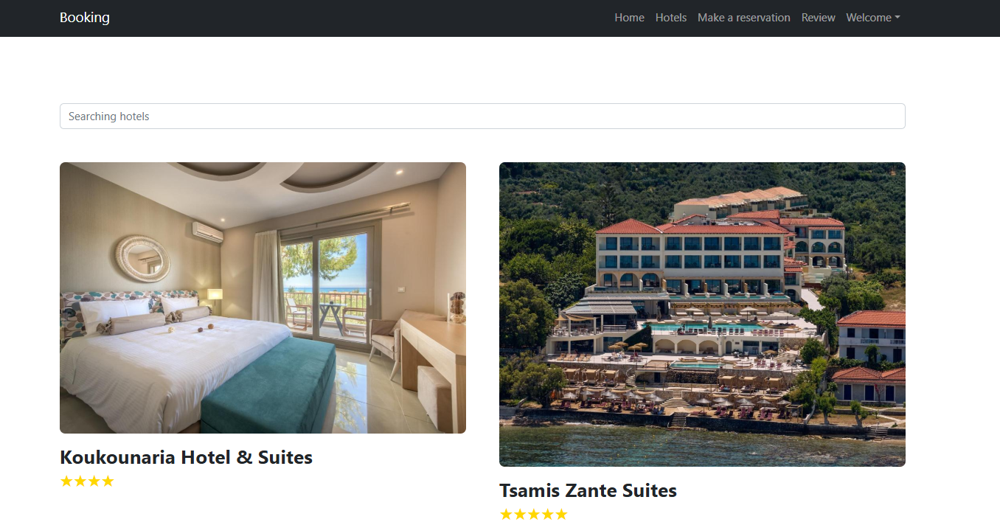
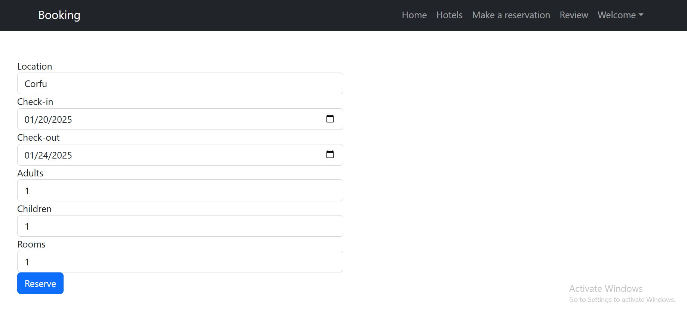
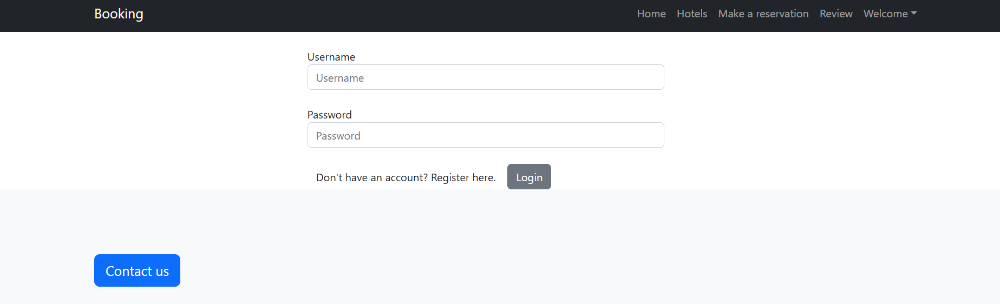
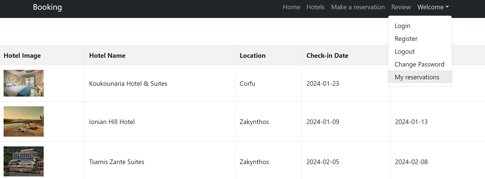
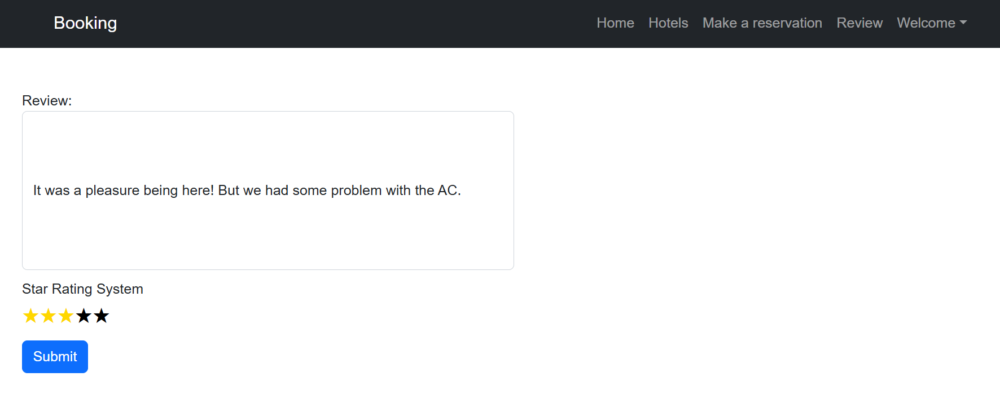

# Hotel Booking System

Welcome to the Hotel Booking System repository! This project is a full-stack web application that allows users to browse hotels, make reservations, leave reviews, and manage their bookings. The frontend is built using **HTML** and **CSS**, the backend is developed with **Spring Boot**, and the database is managed using **PostgreSQL**.

---

## Features

### Navigation Bar
The navigation bar includes the following widgets:
- **Home**: Redirects to the homepage.
  

- **Hotels**: Displays a list of available hotels.
- **Make a Reservation**: Allows users to book a hotel
  
  
- **Review**: Shows all reviews left by users.
- **Welcome**: Contains user-related actions:
  - **Login**: Log in to your account.
  - 
  

  - **Register**: Create a new account.
  - **Logout**: Log out of your account.
  - **Change Password**: Update your account password.
  - **My Reservations**: View all reservations made by the user.
  - 
    

### My Reservations
- Users can view all their reservations in the **My Reservations** section.
- To leave a review for a specific reservation, click on the hotel photo associated with that reservation.

---

### Navbar
- The Navigation Bar (Navbar) dynamically generated using **Thymeleaf**. Thymeleaf's templating engine is used to create reusable components
